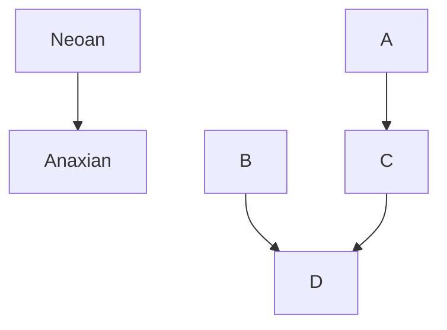

<h1 align="left">The languages of [placeholder]</h1>

The languages within this game are not going to be in-depth just like the religions, this is because it will take way too long write an entire language plus I don't want to make a real con-lang just for this, in the future this will become a posibility but for now this isn't even a thought. The languages within this game are not going to be used often and are mainly just for small little things like phrases, people names, place names, ect... The language won't be a very good one as I'm not very creative for now this will mostly be unused.

Most languages will have different dialects and ways of speaking, the way a language entry will be places within this document is underneath the language or dialect you will place the word or phrase in a box

---------------------------------------------------------------
<h3>Anaxian</h3>

The Anaxian language dialects are some of the oldest and still most used today, and used by many Neoans, and Anaxians alike.

      

<h4>Evolution</h4>

