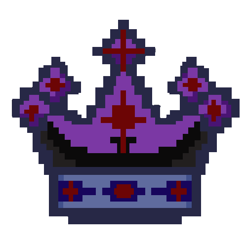

<!--- A note for anyone who contributes to this game in the future, as of now February 13th 2024 I will have to leave in a few months for three months and I will be unable to access any of my electronic devices except for my phone, which I will be unable to use github, discord, or anything that is not google docs or call and messaging service. I'm extremely sorry for this inconvincience and I hope it doesn't cause too many problems. -->

<h1 align="center">
Neo Lands of Neoa</h1>
Welcome to the lands of Neoa, this is a text based game made using C#/Csharp. It is also the first game I have ever developed or tried to make, it may not be the best game ever but we are trying to make the story as fun and followable as we possibly can. There are many plans for this game in the distant and near future. A future thank you to anyone who contributes to the game in the distant future, it really means a lot. 
 
The story of this game is entirely based on the entries found within the lore file, which is going to be completely based on what our small community of people add to it. There are quite a few things we could use help doing with this game, such as lore writing, coding, ect... it may not be followable but if you do want to help the game, or if you'd like to just talk join the <a href="https://discord.gg/EsRTWUwbvp">server</a>, or dm me on discord whichever you would like to do[My discord is z.envo], I'd prefer you join the server. Another thing we could use help with is our game getting discovered by people, so please if you enjoy our game tell your friends about it, or don't its entirely up to you. 
  
All of the story within the game is entirely subject to change and the entirety of the game might possibly be changed at any point of time, slowly or almost instantaneously with some warning/hint, there will reach a point where certain parts will never change and are completely solidified inside of the games lore/code.