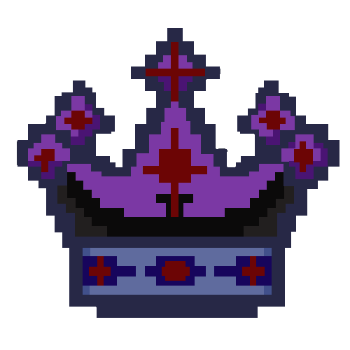

<!--
 -->
<h1 align="center">
Neo Lands of Neoa</h1>
Welcome to the Lands of Neoa. A text based game made using C#/Csharp, it is the very first game I have ever developed or even tried to develop and I don't think its going to be the best game ever, but it will try to be a good experience for those who want to enjoy it, everything in the game is obviously fictional and not meant to be taken seriously but there are some references that might be made to other games, or ideas. The story of this game is something that is constantly changing but everything should be inside of the lore files(found inside of the Docs folder)
which is a collection of entries made, or edited by community members that decided to contribute their own lore to the game, hopefully the lore is readable and comprehendable to people. It might not be followable but if you want explanations you can always DM me on discord, z.envo, is my username, but know for a few months in the future I will have to go for a while and won't be able to do anything on discord or github. 

Now a future thank you for anyone who contributes to the game we really appreciate all of the help we can get with this project, we appreciate the help so much because this project is meant just for fun and you gain nothing out of it, aside from some coding experience and other things.
